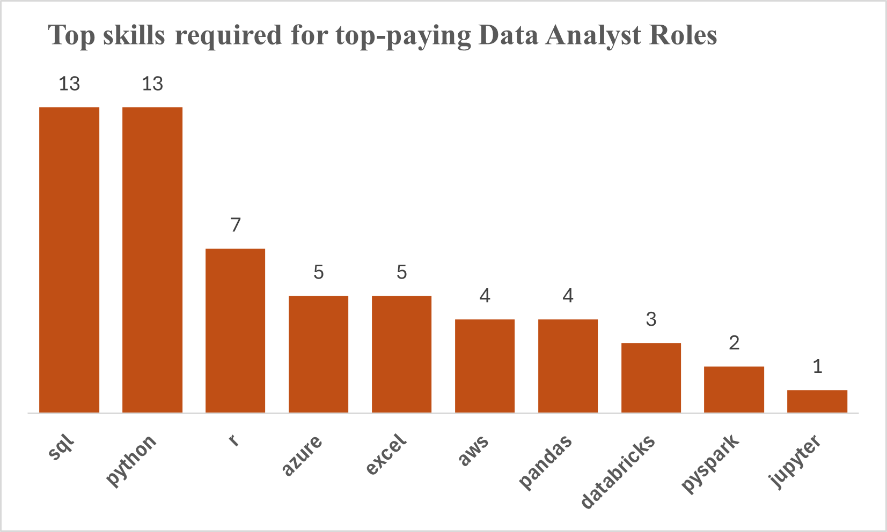

# Introduction
## Exploring Data (Analyst) Job Market Trends in 2023📊🔍

👋 Welcome, this project is focused on analyzing the job 📈 dynamics for data roles in the year 2023! Through this exploration, we aim to provide valuable insights into various aspects of the data job landscape. Key questions addressed include identifying the top-paying jobs 💰, understanding the essential skills required for these roles, uncovering the most in-demand skills 🔍, and identifying optimal skill acquisition pathways 🛣️. Leveraging a comprehensive dataset comprising job postings, company details, and skill information, we employ SQL queries to extract pertinent insights and guide professionals and enthusiasts in navigating the dynamic data job market effectively. Let's dive in and uncover the trends shaping the future of data careers! 🚀.

🔍SQL queries? Check them here: [Project_sql_folder](/Project_sql/) 

# Background

My quest for career advancement leads me to explore the job market in 2023. 🚀 Driven by curiosity and determination, I delve into data on job postings, company profiles, and skill requirements. Through challenges and discoveries, I uncover top-paying roles for Data Analyst, essential skills, and market trends, 📊 emerging not only as a skilled professional but also as a guide for others navigating the dynamic data job landscape. 🌟

Data hails from [Luke Barousse's SQL Course](https://lukebarousse.com/sql).

## The questions I wanted to answer through my SQL queries were:
1. What are the top-paying jobs for a Data Analyst?
2. What are the skills required for these top-paying roles?
3. What are the most in-demand skills for these roles?
4. What are the top-paying skills for Data Analyst role?
5. What are the most optimal skills to learn?


# Tools I used 
I used the following tools
- **SQL:** Leveraged SQL queries to extract insights from the dataset, enabling efficient data analysis and exploration.
  
- **Postgres:** Utilized PostgreSQL as the database management system to store and manage the dataset, ensuring reliability and scalability.
  
- **VSCode:** Employed Visual Studio Code as the integrated development environment (IDE) for writing SQL scripts and managing project files, enhancing productivity and code readability.
  
- **Git:** Utilized Git for version control, allowing for collaborative development and tracking changes made to project files over time, ensuring project integrity and facilitating seamless collaboration.

# The analysis
Each query seeks to investigate specific aspects of the Data Analyst job market. Breakdown of the approach used 👇

## 1. Top-paying jobs for Data Analyst
In the provided SQL query, I extracted data from the "job_postings_fact" table, joining it with the "company_dim" table based on the company ID. Filtering criteria were applied to retrieve information specifically related to the job title "Data Analyst," with a non-null average yearly salary and a location specified as "Anywhere." The results were then sorted in descending order based on the average yearly salary and limited to the top 20 records.

```sql
SELECT
    job_id,
    job_title,
    salary_year_avg,
    name AS company_name
FROM
    job_postings_fact
INNER JOIN company_dim ON
    job_postings_fact.company_id = company_dim.company_id
WHERE
    job_title_short = 'Data Analyst' AND
    salary_year_avg IS NOT NULL AND
    job_location = 'Anywhere'
ORDER BY salary_year_avg DESC
LIMIT 20
```
| job_id  |          job_title          | salary_year_avg |                            company_name                            |
|---------|-----------------------------|-----------------|-------------------------------------------------------------------|
|  226942 | Data Analyst                |      650000.0   | Mantys                                                            |
|  547382 | Director of Analytics      |      336500.0   | Meta                                                              |
|  552322 | Associate Director- Data...|      255829.5   | AT&T                                                              |
|   99305 | Data Analyst, Marketing    |      232423.0   | Pinterest Job Advertisements                                      |
| 1021647 | Data Analyst (Hybrid/Re... |      217000.0   | Uclahealthcareers                                                 |
|  168310 | Principal Data Analyst (... |      205000.0   | SmartAsset                                                        |
|  731368 | Director, Data Analyst -...|      189309.0   | Inclusively                                                       |
|  310660 | Principal Data Analyst, ...|      189000.0   | Motional                                                          |
| 1749593 | Principal Data Analyst     |      186000.0   | SmartAsset                                                        |
|  387860 | ERM Data Analyst            |      184000.0   | Get It Recruit - Information Technology                          |
| 1352513 | REMOTE Director of Data ...|      170000.0   | A-Line Staffing Solutions                                         |
|  987523 | Azure Data Python Consul...|      170000.0   | Kelly Science, Engineering, Technology & Telecom                   |
| 1781684 | DTCC Data Analyst          |      170000.0   | Robert Half                                                       |
| 1525451 | Manager, Data Analyst      |      167000.0   | Uber                                                              |
| 1246069 | Data Analyst               |      165000.0   | Plexus Resource Solutions                                         |
|  712473 | Data Analyst               |      165000.0   | Get It Recruit - Information Technology                          |
| 1423236 | Principal Data Science A...|      164746.0   | Mayo Clinic                                                       |
| 1799883 | Principal Data Science A...|      164746.0   | Mayo Clinic                                                       |
|  618890 | Principal Data Intellige...|      163500.0   | CEDARS-SINAI                                                      |
|  918213 | Senior - Data Analyst      |      160515.0   | DIRECTV                                                           |

### Summary of the result
The query returned a list of the top-paying jobs with the title "Data Analyst", along with their respective average yearly salaries and company names. The results showcase a variety of roles, ranging from traditional data analyst positions to director-level roles and specialized positions in analytics and data science. Companies such as Mantys, Meta, AT&T, and others offer competitive salaries for data-related roles, reflecting the demand for skilled professionals in this domain.

## 2. Skills required for the top-paying jobs

This SQL code retrieves data related to the top-paying Data Analyst jobs, focusing on those with a specified job title, location, and non-null average yearly salary. It first selects job details such as ID, title, salary, and company name from the [`job_postings_fact`](https://lukebarousse.com/sql) table, joining it with the [`company_dim`](https://lukebarousse.com/sql) table. The results are filtered and ordered by salary, limited to the top 20 highest-paying jobs. Then, it joins this dataset with the [`skills_job_dim`](https://lukebarousse.com/sql) and [`skills_dim`](https://lukebarousse.com/sql) tables to include the skills associated with each job. Finally, it selects the relevant columns and orders the result by salary.

```sql
WITH top_paying_jobs AS (
    SELECT
        job_id,
        job_title,
        salary_year_avg,
        name AS company_name
    FROM job_postings_fact
    LEFT JOIN company_dim on job_postings_fact.company_id = company_dim.company_id
    WHERE
        job_title_short = 'Data Analyst' AND
        job_location = 'Anywhere' AND
        salary_year_avg IS NOT NULL
    ORDER BY
        salary_year_avg DESC
    LIMIT(20))

SELECT 
    top_paying_jobs.*,
    skills 
FROM top_paying_jobs
INNER JOIN skills_job_dim ON top_paying_jobs.job_id = skills_job_dim.job_id
INNER JOIN skills_dim ON skills_job_dim.skill_id = skills_dim.skill_id
ORDER BY
    salary_year_avg DESC
LIMIT 20
```


### Summary on the result

The result includes details of the top-paying Data Analyst jobs along with the skills required for each job. From the provided snippet, it's evident that skills such as SQL, Python, R, Azure, AWS, Excel, and others are in demand among these high-paying roles. This insight is valuable for individuals looking to pursue or advance their careers in data analysis, as it highlights the skills that are highly sought after in the current job market.

## 3. Most in-demand skills for these roles?
The SQL code below selects the top 10 most in-demand skills for the job title "Data Analyst" with a requirement for remote work. It achieves this by joining three tables: `job_postings_fact`, `skills_job_dim`, and `skills_dim` based on their respective IDs (`job_id` and `skill_id`). It then counts the occurrences of each skill in the job postings for data analyst roles that allow remote work and presents the results in descending order by the count of job postings that mention each skill. Finally, it limits the output to only the top 10 skills.

```sql
SELECT
    skills,
    COUNT(job_postings_fact.job_id) AS demand_count
FROM job_postings_fact
INNER JOIN skills_job_dim ON job_postings_fact.job_id = skills_job_dim.job_id
INNER JOIN skills_dim ON skills_job_dim.skill_id = skills_dim.skill_id
WHERE
    job_title_short = 'Data Analyst' AND
    job_work_from_home = TRUE
GROUP BY
    skills
ORDER BY
    demand_count DESC
LIMIT 10

```

### Result
| skills      | demand_count |
|-------------|--------------|
| sql         | 7291         |
| excel       | 4611         |
| python      | 4330         |
| tableau     | 3745         |
| power bi    | 2609         |
| r           | 2142         |
| sas         | 1866         |
| looker      | 868          |
| azure       | 821          |
| powerpoint  | 819          |

### Summary on the result

The analysis of the result would provide insight into the most sought-after skills for remote data analyst positions. This information can be valuable for individuals seeking to enhance their skills for career advancement or for companies looking to tailor their hiring strategies to meet market demands.

## 4. What are the top-paying skills for Data Analyst role?

This SQL code retrieves the average annual salary for Data Analyst positions that allow remote work, grouped by specific skills. It calculates the average salary by joining three tables: `job_postings_fact`, `skills_job_dim`, and `skills_dim`, based on their respective IDs (`job_id` and `skill_id`). It filters out records where the average salary is not available (`salary_year_avg IS NOT NULL`), and limits the search to Data Analyst roles that offer remote work (`job_work_from_home = TRUE`). Then, it groups the results by skills and orders them by the average salary in descending order, displaying the top 20 skills.

```sql
SELECT
    skills,
    ROUND(AVG(salary_year_avg),0) AS Average_salary
FROM job_postings_fact
INNER JOIN skills_job_dim ON job_postings_fact.job_id = skills_job_dim.job_id
INNER JOIN skills_dim ON skills_job_dim.skill_id = skills_dim.skill_id
WHERE
    job_title_short = 'Data Analyst' AND
    salary_year_avg IS NOT NULL
    AND job_work_from_home = TRUE
GROUP BY
    skills
ORDER BY
    Average_salary DESC
LIMIT 10
```
| skills        | average_salary |
|---------------|----------------|
| pyspark       | 208172         |
| bitbucket     | 189155         |
| watson        | 160515         |
| couchbase     | 160515         |
| datarobot     | 155486         |
| gitlab        | 154500         |
| swift         | 153750         |
| jupyter       | 152777         |
| pandas        | 151821         |
| elasticsearch | 145000         |

### Summary of the result

The analysis of the result provides insights into the skills that are associated with higher average salaries for remote Data Analyst positions. This information can be valuable for individuals looking to specialize or upskill in certain areas to potentially command higher salaries, and for companies to understand the market value of specific skill sets when hiring for remote Data Analyst roles.

## 5. What are the most optimal skills to learn? (High demand and high paying)

The SQL query retrieves information about the demand for skills among Data Analyst roles that offer remote work opportunities. It selects the skill ID and name from the "skills_dim" table, counts the number of job postings for each skill, calculates the average salary for jobs requiring each skill, and filters the results for Data Analyst positions with remote work options and non-null average salaries. The query groups the results by skill ID and name, ensuring distinct skill entries, and applies a filter to include only skills with a demand count exceeding 50 job postings. Finally, it sorts the results by average salary in descending order and demand count in descending order, limiting the output to the top 10 entries.

```sql
SELECT
    skills_dim.skill_id,
    skills,
    COUNT(job_postings_fact.job_id) as demand_count,
    ROUND(AVG(salary_year_avg), 0) as avg_salary
FROM
    job_postings_fact
INNER JOIN skills_job_dim ON
    job_postings_fact.job_id = skills_job_dim.job_id
INNER JOIN skills_dim ON
    skills_job_dim.skill_id = skills_dim.skill_id
WHERE
    job_title_short = 'Data Analyst' AND
    job_work_from_home = TRUE AND
    salary_year_avg IS NOT NULL 
GROUP BY 
    skills_dim.skill_id, 
    skills
HAVING 
    COUNT(job_postings_fact.job_id) > 50
ORDER BY
    avg_salary DESC,
    demand_count DESC
LIMIT 10;
```


| Skills       | Demand Count | Average Salary |
|--------------|--------------|----------------|
| python       | 236          | $101,397       |
| r            | 148          | $100,499       |
| tableau      | 230          | $99,288        |
| sas          | 63           | $98,902        |
| power bi     | 110          | $97,431        |
| sql          | 398          | $97,237        |
| powerpoint   | 58           | $88,701        |
| excel        | 256          | $87,288        |

### Summary of Result:

The result provides insights into the demand for various skills among remote Data Analyst positions, along with the average salary associated with each skill. Python emerges as the most in-demand skill, with 236 job postings and an average salary of $101,397. Following closely are R, Tableau, and SAS, each demonstrating significant demand with competitive average salaries. These findings highlight the importance of skills such as Python, R, and visualization tools like Tableau in the remote Data Analyst job market, offering valuable guidance for skill acquisition and career advancement strategies.

# What I learnt
1. **SQL Skills:** Gained proficiency in writing SQL queries to extract, filter, and analyze data from relational databases.

2. **Data Analysis Techniques:** Through querying and analyzing the dataset,I have learned techniques for deriving valuable insights regarding job roles, salaries, required skills, and market trends.

3. **Understanding Job Market Dynamics:** By examining the dataset and interpreting the results, I have developed an understanding of job market dynamics, including top-paying roles, in-demand skills, and the interplay between skill demand and salary levels.

# Conclusions

**Conclusion:**

Through the analysis of job postings data for data roles in 2023, valuable insights have been uncovered regarding top-paying positions, companies, and skill requirements. By leveraging SQL queries and data analysis techniques, a comprehensive understanding of the data job market landscape has been achieved. 📊 The exploration of top-paying roles has provided clarity on salary trends and key players in the industry, while the analysis of required skills has highlighted the importance of proficiency in tools such as Python, SQL, and visualization platforms like Tableau. 🚀 This project has not only enhanced technical skills in SQL and data analysis but also provided actionable insights for career advancement and skill development strategies in the dynamic field of data analytics. 🌟

